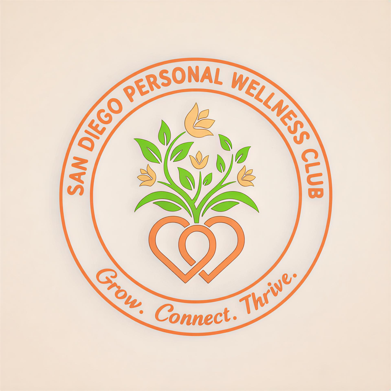

# San Diego Personal Wellness Club Website



**Motto:** *Align. Connect. Thrive.*

## 📋 Table of Contents

- [About](#about)
- [Features](#features)
- [Project Structure](#project-structure)
- [Setup Instructions](#setup-instructions)
- [Mailchimp Integration](#mailchimp-integration)
- [Deployment to GitHub Pages](#deployment-to-github-pages)
- [Customization Guide](#customization-guide)
- [Brand Colors](#brand-colors)
- [Browser Support](#browser-support)
- [Contributing](#contributing)
- [License](#license)

## 🌿 About

This is the official website for the San Diego Personal Wellness Club, a vibrant community dedicated to personal growth, authentic connections, and evidence-based wellness practices. The website is built as a static site using HTML5, CSS3, JavaScript, and Tailwind CSS, optimized for GitHub Pages deployment.

## ✨ Features

- **Fully Responsive Design**: Mobile-first approach with seamless experience across all devices
- **Modern UI/UX**: Clean, accessible design following WCAG AA standards
- **Tailwind CSS Integration**: Utility-first CSS framework for rapid development
- **Custom Brand Styling**: Complete color palette reflecting San Diego's natural beauty
- **Interactive Elements**: 
  - Mobile-friendly navigation menu
  - Smooth scrolling
  - Hover effects and animations
  - Fade-in animations on scroll
- **Email Signup Form**: Ready for Mailchimp integration
- **Social Media Integration**: Links to Instagram, Facebook, TikTok, and Discord
- **SEO Optimized**: Meta tags, semantic HTML, and proper heading structure
- **Fast Loading**: Minimal dependencies, optimized assets

## 📁 Project Structure

```
sdwc_website/
├── index.html              # Home page
├── README.md               # This file
├── assets/                 # Favicons and static assets
│   ├── favicon.ico
│   ├── favicon_32x32.png
│   ├── favicon_192x192.png
│   └── images/
│       └── website_header_logo.png  # Club logo
└── src/                    # Source code
    ├── events.html         # Events page
    ├── css/
    │   └── style.css       # Custom styles and brand colors
    └── js/
        └── main.js         # Interactive JavaScript functionality
```

## 🚀 Setup Instructions

### Prerequisites

- A web browser (Chrome, Firefox, Safari, or Edge)
- A text editor (VS Code, Sublime Text, etc.)
- Basic knowledge of HTML/CSS (optional)

### Local Development

1. **Clone or Download the Repository**
   ```bash
   git clone <repository-url>
   cd sdwc_website
   ```

2. **Open in Browser**
   - Simply open `index.html` in your web browser
   - Or use a local server for better development experience:
   
   **Using Python:**
   ```bash
   # Python 3
   python -m http.server 8000
   
   # Then visit: http://localhost:8000
   ```
   
   **Using Node.js (with http-server):**
   ```bash
   npx http-server -p 8000
   
   # Then visit: http://localhost:8000
   ```
   
   **Using VS Code Live Server Extension:**
   - Install the "Live Server" extension
   - Right-click `index.html` and select "Open with Live Server"

3. **Start Developing**
   - Edit `index.html` in the root directory
   - Edit `src/events.html` for the events page
   - Modify styles in `src/css/style.css`
   - Update JavaScript in `src/js/main.js`
   - Changes will reflect immediately in the browser

## 📧 Mailchimp Integration

The website includes a placeholder email signup form ready for Mailchimp integration.

### Step-by-Step Integration:

1. **Create a Mailchimp Account**
   - Go to [https://mailchimp.com](https://mailchimp.com)
   - Sign up for a free account

2. **Create an Audience**
   - Navigate to "Audience" → "Audience Dashboard"
   - Click "Create Audience"
   - Fill in your organization details

3. **Get the Embedded Form Code**
   - Go to "Audience" → "Signup Forms" → "Embedded Forms"
   - Find the form action URL (looks like):
     ```
     https://YOURDOMAIN.us1.list-manage.com/subscribe/post?u=XXXXX&id=YYYYY
     ```

4. **Update index.html**
   - Open `index.html` in your text editor
   - Find the email signup form (around line 200)
   - Replace `action="#"` with your Mailchimp form action URL:
   
   ```html
   <!-- BEFORE: -->
   <form action="#" method="POST" class="email-form" id="emailSignupForm">
   
   <!-- AFTER: -->
   <form action="https://YOURDOMAIN.us1.list-manage.com/subscribe/post?u=XXXXX&id=YYYYY" 
         method="POST" 
         class="email-form" 
         id="emailSignupForm">
   ```

5. **Test the Form**
   - Submit a test email address
   - Check your Mailchimp dashboard to confirm the subscription

### Optional: Custom Success/Error Pages

You can add custom success and error URLs by adding these hidden fields to the form:

```html
<input type="hidden" name="b_XXXXX_YYYYY" value="">
<input type="hidden" name="MERGE0" value="">
```

## 🌐 Deployment to GitHub Pages

### Option 1: Deploy from Main Branch

1. **Push Your Code to GitHub**
   ```bash
   git init
   git add .
   git commit -m "Initial commit - SDWC website"
   git branch -M main
   git remote add origin https://github.com/YOUR_USERNAME/YOUR_REPO.git
   git push -u origin main
   ```

2. **Enable GitHub Pages**
   - Go to your repository on GitHub
   - Click "Settings" → "Pages"
   - Under "Source", select "Deploy from a branch"
   - Select "main" branch and "/ (root)" folder
   - Click "Save"

3. **Access Your Site**
   - Your site will be available at:
     ```
     https://YOUR_USERNAME.github.io/YOUR_REPO/
     ```
   - It may take a few minutes to deploy initially

### Option 2: Deploy from gh-pages Branch

1. **Create a gh-pages Branch**
   ```bash
   git checkout -b gh-pages
   git push origin gh-pages
   ```

2. **Enable GitHub Pages**
   - Go to Settings → Pages
   - Select "gh-pages" branch
   - Click "Save"

### Custom Domain (Optional)

1. **Purchase a Domain** (e.g., from Namecheap, GoDaddy)

2. **Configure DNS**
   - Add a CNAME record pointing to: `YOUR_USERNAME.github.io`
   - Or add A records pointing to GitHub's IP addresses:
     ```
     185.199.108.153
     185.199.109.153
     185.199.110.153
     185.199.111.153
     ```

3. **Update GitHub Settings**
   - Go to Settings → Pages
   - Enter your custom domain in "Custom domain"
   - Check "Enforce HTTPS"

4. **Update Links**
   - Make sure all internal links use relative paths
   - Update any absolute URLs in your HTML files

## 🎨 Customization Guide

### Changing Colors

All brand colors are defined in `src/css/style.css` using CSS custom properties:

```css
:root {
  --orange-primary: #EB7D3F;
  --green-primary: #76C442;
  --ocean-pacific: #2B7A9F;
  /* ... more colors */
}
```

To change colors, simply update these values.

### Adding New Pages

1. **Create a new HTML file** (e.g., `about.html`)
2. **Copy the structure** from `index.html` or `events.html`
3. **Update navigation** in all HTML files to include the new page
4. **Add content** specific to your new page

### Updating Social Media Links

Edit the footer section in both `index.html` and `events.html`:

```html
<a href="YOUR_INSTAGRAM_URL" target="_blank" class="social-icon">
  <i class="fab fa-instagram"></i>
</a>
```

### Modifying the Logo

Replace `assets/images/website_header_logo.png` with your new logo. For best results:
- Use a transparent PNG
- Recommended size: 300-400px width
- Maintain aspect ratio

## 🎨 Brand Colors

The website uses the official SDWC color palette:

| Color Name | Hex Code | Usage |
|------------|----------|-------|
| Orange Primary | `#EB7D3F` | Primary CTA buttons, accents |
| Green Primary | `#76C442` | "Align" pillar, nature elements |
| Ocean Pacific | `#2B7A9F` | "Thrive" pillar, hero backgrounds |
| Cream Background | `#F3E4D7` | Alternate section backgrounds |
| Charcoal Text | `#2C2C2C` | Body text, headings |
| White Clean | `#FFFFFF` | Backgrounds, cards |

View the complete color palette in `css/style.css`.

## 🌍 Browser Support

The website is tested and supported on:

- ✅ Chrome (latest)
- ✅ Firefox (latest)
- ✅ Safari (latest)
- ✅ Edge (latest)
- ✅ Mobile browsers (iOS Safari, Chrome Mobile)

### Minimum Supported Versions:
- Chrome 90+
- Firefox 88+
- Safari 14+
- Edge 90+

## 🤝 Contributing

We welcome contributions from the community! Here's how you can help:

1. **Report Bugs**: Open an issue describing the problem
2. **Suggest Features**: Share your ideas for improvements
3. **Submit Pull Requests**: 
   - Fork the repository
   - Create a feature branch
   - Make your changes
   - Submit a pull request

### Development Guidelines:

- Follow existing code style and formatting
- Test on multiple browsers before submitting
- Ensure all links work correctly
- Maintain responsive design principles
- Comment your code where necessary

## 📱 Social Media

Connect with us:

- **Discord**: [https://discord.gg/KWgEkXCCzY](https://discord.gg/KWgEkXCCzY)
- **Instagram**: [@sandiegowellnessclub](https://instagram.com/sandiegowellnessclub)
- **TikTok**: [@sandiegowellnessclub](https://tiktok.com/@sandiegowellnessclub)
- **Facebook**: Coming Soon

## 📄 License

© 2025 San Diego Personal Wellness Club. All rights reserved.

---

## 🆘 Troubleshooting

### Website Not Displaying Correctly

- Clear your browser cache
- Check that all file paths are correct
- Ensure Tailwind CSS CDN is loading
- Open browser console (F12) to check for errors

### Images Not Loading

- Verify image files are in the `images/` and `assets/` folders
- Check file paths are relative (not absolute)
- Ensure image filenames match exactly (case-sensitive)

### Mailchimp Form Not Working

- Verify the form action URL is correct
- Check that the method is "POST"
- Ensure email input has name="EMAIL"
- Test with a real email address

### GitHub Pages Not Deploying

- Check that repository is public
- Verify GitHub Pages is enabled in settings
- Allow 5-10 minutes for initial deployment
- Check repository Actions tab for build errors

## 📞 Support

For questions or support:

1. Join our [Discord community](https://discord.gg/KWgEkXCCzY)
2. Open an issue on GitHub
3. Contact us through social media

---

**Built with ❤️ by the San Diego Personal Wellness Club community**

*Align. Connect. Thrive.*
